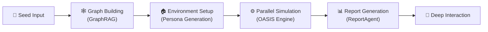

<div align="center">


# MiroFishPlus

**An enhanced continuation of the official [MiroFish](https://github.com/666ghj/MiroFish) and the community [MiroFish-local](https://github.com/tt-a1i/MiroFish-local) project.**

*A multi-agent swarm intelligence engine for public opinion, market sentiment, and social dynamics, with local graph, configuration, and task storage.*

[](https://github.com/mustangcoder/MiroFishPlus/stargazers)
[](https://github.com/mustangcoder/MiroFishPlus/network)
[](https://github.com/mustangcoder/MiroFishPlus/blob/main/LICENSE)
[](https://www.docker.com/)

[English](./README-EN.md) | [中文文档](./README.md)

</div>

## 🤔 What is this?

[MiroFish](https://github.com/666ghj/MiroFish) is a multi-agent AI prediction engine that constructs high-fidelity parallel digital worlds for swarm intelligence simulation. However, the original MiroFish relies entirely on **Zep Cloud** for memory and knowledge graph services — data passes through a third-party cloud, and it cannot run in offline environments.

The community project [tt-a1i/MiroFish-local](https://github.com/tt-a1i/MiroFish-local) introduced the **Graphiti + Neo4j local graph mode**, the `ZEP_BACKEND` dual-backend switch, and the local deployment foundation. MiroFishPlus inherits that work and adds multi-protocol model configuration, ChatGPT Subscription OAuth, SQLite-backed recovery, Graphiti ontology typing, long-running task reliability, and one-command migration and deployment.

## 🔀 Differences from the Official Project

This repository is based on both [666ghj/MiroFish](https://github.com/666ghj/MiroFish) and [tt-a1i/MiroFish-local](https://github.com/tt-a1i/MiroFish-local). It is **not an official release of either project and does not represent their maintainers**. The comparison below uses the official `main` branch as of **2026-09-02**.

| Lineage | Primary contribution |
|---------|----------------------|
| Official MiroFish | Core multi-agent workflow, OASIS dual-platform simulation, knowledge graph, and ReportAgent pipeline |
| MiroFish-local | Graphiti + Neo4j local graph backend, Zep Cloud/Graphiti switching, and local deployment foundation |
| MiroFishPlus | Multi-protocol model configuration, OAuth Gateway, unified SQLite and recovery, ontology typing, graph repair, reliability improvements, and complete one-command migration |

| Area | Official project (comparison baseline) | MiroFishPlus |
|------|----------------------------------------|----------------|
| Primary focus | General-purpose multi-agent prediction engine using Zep Cloud by default | Preserves the upstream workflow while emphasizing local deployment, model connectivity, and long-running task reliability |
| Graph service | Zep Cloud | Select Zep Cloud or **Graphiti + Neo4j 5.26** in Configuration Center |
| Local graph typing | Not applicable | Applies the project ontology to Graphiti, preserves business labels, and distinguishes people, institutions, regions, and events |
| Text protocols | A single OpenAI SDK-compatible LLM configured through environment variables | Protocol layer supports **OpenAI Responses, OpenAI Chat Completions, and Anthropic Messages** |
| Embeddings | Configured through the upstream environment | Separate OpenAI Embeddings protocol; its Provider and model can differ from text generation |
| Model connectivity | API key, Base URL, and model name in `.env` | Configuration Center separates Provider, protocol, authentication, and model; supports API Key, no-auth HTTP, and a ChatGPT Subscription OAuth Gateway |
| Model roles | Primary model plus an optional boost model | Independent high-capability, fast, and Embedding roles with project-level configuration snapshots |
| Context management | Relies primarily on model/API defaults | Configurable maximum context, dynamic trimming with paired tool calls/results, and automatic truncation for standard Responses endpoints |
| Configuration persistence | Primarily `.env` based | Models, graph backend, task history, and preparation checkpoints share `backend/uploads/mirofishplus.db` |
| Environment preparation recovery | A page or service interruption may restart preparation | Commits every completed persona to SQLite and resumes only missing personas after navigation or service restart |
| Simulation graph ingestion | Dual-platform simulation with dynamic memory updates | Adds same-round batching, character/Token budgets, rate-limit backoff, completion barriers, and exact recovery of missing Episodes |
| Workflow history | Upstream baseline workflow | Routes history entries to the latest persisted stage instead of regenerating personas or restarting simulations |
| Reports and interviews | ReportAgent interacts with the simulation environment and graph tools | Verifies the real OASIS process, marks stale `alive` files as `stale`, and immediately falls back to graph search when interviews are unavailable |
| Docker startup | Copy `.env`, then run `docker compose up -d` with the official image | `npm run docker:up` builds current local code, starts Neo4j/Gateway, initializes SQLite idempotently, and waits for health checks |
| Hugging Face assets | Downloaded by the runtime environment | Persistent cache, pre-download, and explicit download timeout |

### Compatibility and Maintenance Boundaries

- **Local does not automatically mean fully offline.** Graphiti and Neo4j can stay on the machine, but a selected text or Embedding Provider may still be a remote HTTP service. Model data remains local only when every Provider points to a local endpoint.
- **The ChatGPT Subscription OAuth Gateway is not an official public OpenAI API.** It depends on internal ChatGPT/Codex endpoints and may break when upstream protocols, permissions, or rate-limit policies change. Prefer a stable official API-key integration for production use.
- **Existing graphs are not automatically retyped.** Local Graphiti graphs built before this change with only `Entity` / `GenericEntity` labels must be force-rebuilt to receive ontology labels and improved persona classification.
- **Zep Cloud and local Graphiti are not guaranteed to produce identical results.** Extraction, deduplication, search, and temporal relationship behavior can differ; rebuild and validate the graph after switching.
- Treat the official repository as the source of truth for upstream features, issues, and releases. Enhancements and defects introduced by this fork are maintained separately here.

## ⚡ 3-Minute Quick Demo

```bash
git clone https://github.com/mustangcoder/MiroFishPlus.git
cd MiroFishPlus
cp .env.example .env           # Edit .env and add your LLM_API_KEY
npm run setup:all              # Install dependencies
npm run backend &              # Start backend
python demo.py                 # Run the demo!
```

The demo script auto-uploads a [sample news article](./examples/seed_news.txt), calls the LLM to extract entities and relationships, and builds a knowledge graph — giving you a hands-on feel for MiroFish's core capabilities.

## 🏗️ Architecture



| Module | Description |
|--------|-------------|
| **Seed Input** | Accepts user-uploaded seed materials (news, reports, novels, etc.) and parses prediction requirements |
| **Graph Building** | Extracts entity relationships via GraphRAG, injects individual and collective memory to build the knowledge graph. Local mode uses Graphiti + Neo4j instead of Zep Cloud |
| **Environment Setup** | Automatically generates agent personas; environment configuration Agent injects simulation parameters |
| **Parallel Simulation** | OASIS engine drives large-scale agent interactions in parallel, dynamically updating temporal memory |
| **Report Generation** | ReportAgent uses a rich toolset to deeply interact with the post-simulation environment and produce prediction reports |
| **Deep Interaction** | Users can chat with any character in the simulated world or discuss further with ReportAgent |

## 🔄 Workflow

1. **Graph Building** — Seed extraction & individual/collective memory injection & GraphRAG construction. The system extracts key entities and relationships from user-uploaded seed materials, building a structured knowledge graph that lays the information foundation for the simulated world.

2. **Environment Setup** — Entity relationship extraction & persona generation & environment configuration Agent injects simulation parameters. Based on the knowledge graph, agents with independent personalities and backstories are automatically generated, and social network topology and initial behavioral parameters are configured.

3. **Simulation** — Dual-platform parallel simulation & automatic prediction requirement parsing & dynamic temporal memory updates. The OASIS engine drives agents to interact freely in the simulated environment, recording behavioral trajectories and attitude shifts in real time.

4. **Report Generation** — ReportAgent with a rich toolset for deep interaction with the post-simulation environment. Simulation data is aggregated and analyzed across multiple dimensions to identify collective behavior patterns, producing structured prediction reports.

5. **Deep Interaction** — Chat with any character in the simulated world & interact with ReportAgent. Users can intervene in the simulated world at any time, exploring how outcomes evolve under different decision paths.

## 🎯 Use Cases

| Scenario | Description |
|----------|-------------|
| 🗞️ **Public Opinion Forecasting & Crisis PR Rehearsal** | Simulate how breaking events propagate through social networks, predict public opinion trajectories, and develop response strategies in advance |
| 💹 **Financial Market Sentiment Analysis** | Build investor behavioral models, simulate market reactions to policies and events, and support investment decisions |
| 🏛️ **Policy Impact Assessment** | Preview policy implementation effects in a virtual society, observing behavioral feedback and social impact across different demographics |
| ✍️ **Creative Experiments** | Novel ending deduction, historical event replay, thought experiments — let your imagination run free in a digital world |
| 🔬 **Social Science Research Simulation** | Provide a large-scale, controllable experimental platform for sociology, communication studies, behavioral economics, and more |

## 🚀 Quick Start

### Prerequisites

> Note: MiroFish was developed and tested on Mac. Windows compatibility is unknown and currently under testing.

| Tool | Version | Description | Check Installation |
|------|---------|-------------|-------------------|
| **Python** | 3.11+ | Backend runtime | `python --version` |
| **Node.js** | 18+ | Frontend runtime, includes npm | `node -v` |
| **uv** | Latest | Python package manager | `uv --version` |
| **Docker** *(optional)* | Latest | Start dependency services (Neo4j) for local mode | `docker --version` |

### 1. Configure Environment Variables

```bash
# Copy the example configuration file
cp .env.example .env

# Edit the .env file and fill in the required API keys
```

Environment variables are organized into the following groups:

#### LLM API Configuration (Required)

Supports OpenAI Responses, OpenAI Chat Completions, and Anthropic Messages. For Alibaba Bailian qwen-plus, select `openai_chat_completions`.

> Note: Simulations can be resource-intensive. Start with fewer than 40 rounds to get a feel for costs.

Docker persists Hugging Face assets in the `huggingface_cache` volume and pre-downloads the OASIS Twitter recommender through the separate `hf-prefetch` service. Simulation startup verifies the cache again and fails clearly after a 15-minute download timeout instead of remaining indefinitely in the running state.

MiroFishPlus-owned model configuration, background tasks, and environment-preparation checkpoints share `backend/uploads/mirofishplus.db`. Upgrades first copy the legacy `mirofish.db` without removing it, then idempotently import `model-config/models.db` and `tasks/tasks.db` while retaining every source file. OASIS Twitter and Reddit databases remain separate per simulation. Each completed persona is committed as a checkpoint, so an abnormal service restart reuses the original task and continues with only the missing personas.

```env
LLM_API_KEY=your_api_key
LLM_BASE_URL=https://dashscope.aliyuncs.com/compatible-mode/v1
LLM_MODEL_NAME=qwen-plus
LLM_PROTOCOL=openai_chat_completions
```

The configuration center stores model vendor, API protocol, and authentication separately. One provider connection can enable multiple automatically detected or manually corrected protocols. Each model role selects its provider, protocol, and concrete model, so one LM Studio connection can serve both text generation and Embedding. Supported values are `openai_responses`, `openai_chat_completions`, `anthropic_messages`, and `openai_embeddings`. From Docker, use `http://host.docker.internal:<port>/v1` for a model service running on the host.

#### Knowledge Graph Service Selection

Use `ZEP_BACKEND` to select how the knowledge graph is stored and queried:

| Value | Mode | Description |
|-------|------|-------------|
| `cloud` | Zep Cloud (default) | Zero configuration, free monthly quota to get started |
| `graphiti` | Local Graphiti + Neo4j | Fully local, data stays on-premise |

```env
ZEP_BACKEND=cloud
```

#### Zep Cloud Configuration (Required when `ZEP_BACKEND=cloud`)

Free registration: https://app.getzep.com/

```env
ZEP_API_KEY=your_zep_api_key
```

#### Graphiti / Neo4j Local Configuration (Required when `ZEP_BACKEND=graphiti`)

```env
NEO4J_URI=bolt://localhost:7687
NEO4J_USER=neo4j
NEO4J_PASSWORD=password

# LLM models used by Graphiti (explicit configuration recommended)
GRAPHITI_LLM_MODEL=qwen3-max
GRAPHITI_LLM_PROTOCOL=openai_chat_completions
GRAPHITI_EMBEDDING_MODEL=text-embedding-v4
```

> `OPENAI_API_KEY` / `OPENAI_BASE_URL` are automatically mapped from `LLM_API_KEY` / `LLM_BASE_URL` — no need to configure them separately. To specify a different LLM for Graphiti, explicitly set `OPENAI_API_KEY` and `OPENAI_BASE_URL`.

> **Ontology type migration:** Newly built local graphs apply the project ontology during Graphiti extraction and preserve business labels such as `CompanyExecutive` and `ListedCompany` on Neo4j nodes. Graphs built before this change that contain only `Entity` / `GenericEntity` are not rewritten automatically; force-rebuild the project graph and prepare the simulation environment again to regenerate profiles. Zep Cloud ontology writes are unchanged, while both backends share the same person/institution/region/event classifier.

> **Model context:** Text-model roles in Configuration Center require a “Maximum context Tokens” value. Known GPT-5.6 models autofill `1,050,000`; unknown models require a manual value. Simulations dynamically reserve 10% of the selected window (minimum 16K, maximum 128K) for output and reasoning. When input exceeds the remaining budget, the full persona and system instructions are preserved while the oldest conversation history is removed; tool calls and their results remain paired. Standard Responses providers also receive `truncation: auto`; ChatGPT Subscription OAuth relies on local compaction because its private Codex endpoint rejects that field. This setting is independent of Graphiti's 9,500-character Episode limit.

#### Boost LLM Configuration (Optional)

Configure a separate LLM to accelerate specific pipeline stages:

```env
LLM_BOOST_API_KEY=your_boost_api_key
LLM_BOOST_BASE_URL=https://another-api-provider.com/v1
LLM_BOOST_MODEL_NAME=gpt-4o-mini
```

### 2. One-command Docker Startup (Recommended)

Make sure Docker Desktop is running, then execute from the project root:

```bash
npm run docker:up
```

This command creates a missing `.env`, migrates legacy Docker volumes, starts Neo4j 5.26 and the Direct OAuth Gateway, initializes or migrates `backend/uploads/mirofishplus.db`, starts MiroFishPlus, and waits for its health check. Re-running it never resets model configuration, task history, preparation checkpoints, uploads, or Docker volumes.

On the first upgrade from the legacy Docker names, the script stops but retains the old containers, copies each `mirofish_*` named volume read-only into its `mirofishplus_*` replacement, verifies file and byte counts, and writes a migration marker. Old volumes are never deleted, so the first migration temporarily requires approximately the same amount of additional disk space. Production volumes such as `mirofishplus_uploads` and `mirofishplus_embedding_cache` can be migrated with `scripts/migrate-docker-volume.sh OLD_VOLUME NEW_VOLUME` under the same rules.

Service URLs:

- Frontend: `http://localhost:3000`
- Backend health check: `http://localhost:5001/health`
- Neo4j Browser: `http://localhost:7474`

On failure, the script preserves the containers and prints a diagnostic command. Logs are also available with:

```bash
docker compose -f docker-compose.yml -f docker-compose.local.yml logs --tail=200
```

### 3. Start Dependency Services Manually (Optional)

If you chose `ZEP_BACKEND=graphiti`, start the Neo4j database first:

```bash
# Start dependency services (Neo4j 5.26 + APOC plugin) via Docker Compose
docker-compose -f docker-compose.local.yml up -d

# Check service status
docker-compose -f docker-compose.local.yml ps

# Neo4j Browser available at http://localhost:7474 (user: neo4j, password: password)
```

### 4. Install Dependencies

```bash
# One-click installation of all dependencies (root + frontend + backend)
npm run setup:all
```

Or install step by step:

```bash
# Install Node dependencies (root + frontend)
npm run setup

# Install Python dependencies (auto-creates virtual environment)
npm run setup:backend
```

### 5. Start Non-Docker Development Services

```bash
# Start both frontend and backend (run from project root)
npm run dev
```

**Service URLs:**
- Frontend: `http://localhost:3000`
- Backend API: `http://localhost:5001`

**Start Individually:**

```bash
npm run backend   # Start backend only
npm run frontend  # Start frontend only
```

## 💻 Hardware Requirements

MiroFish is an LLM-calling application — the heavy computation is handled by remote LLM APIs, so local resource requirements are modest.

| Tier | CPU | RAM | Disk | GPU |
|------|-----|-----|------|-----|
| **Minimum** | 4 cores | 8 GB | 10 GB | Not required |
| **Recommended** | 8 cores | 16 GB | 20 GB | Not required |

> Note: A GPU is only needed if you deploy an LLM locally (e.g., running a local model with Ollama). No GPU is required when using cloud LLM APIs.

## ❓ FAQ

<details>
<summary><b>What's the difference between Cloud and Local mode?</b></summary>

Cloud mode uses Zep Cloud for memory and knowledge graph storage — easy to set up but data passes through a third-party cloud. Local mode uses Graphiti + Neo4j, keeping all data on-premise. Ideal for privacy-sensitive or air-gapped environments. Switch with the `ZEP_BACKEND` environment variable.
</details>

<details>
<summary><b>Neo4j won't start — what do I do?</b></summary>

1. Confirm Docker is installed and running: `docker --version`
2. Check if ports 7474/7687 are in use: `lsof -i :7474`
3. Check container logs: `docker-compose -f docker-compose.local.yml logs neo4j`
4. Try a clean restart: `docker-compose -f docker-compose.local.yml down -v && docker-compose -f docker-compose.local.yml up -d`
</details>

<details>
<summary><b>Which LLMs are supported?</b></summary>

Any LLM API compatible with the OpenAI SDK format, including: Alibaba Bailian (qwen-plus/qwen-max), OpenAI (GPT-4o), DeepSeek, local Ollama, and more. Just configure `LLM_BASE_URL` and `LLM_API_KEY`.
</details>

<details>
<summary><b>How many tokens does a simulation cost?</b></summary>

It depends on the number of agents and simulation rounds. For your first run, we recommend fewer than 40 rounds, which typically consumes ~500K–1M tokens.
</details>

## 🤝 Contributing

We welcome Pull Requests and Issues! See [CONTRIBUTING.md](./CONTRIBUTING.md) for details.

## 📄 Credits & Attribution

**This project is based on both the official [666ghj/MiroFish](https://github.com/666ghj/MiroFish) and the community [tt-a1i/MiroFish-local](https://github.com/tt-a1i/MiroFish-local) project.**

Thanks to the official project, Shanda Group, and the MiroFish-local maintainers for the open-source Graphiti + Neo4j localization work. MiroFish's core simulation engine is powered by **[OASIS](https://github.com/camel-ai/oasis)**, developed by the [CAMEL-AI](https://github.com/camel-ai) team.

On top of that foundation, MiroFishPlus adds Configuration Center, multiple model protocols, OAuth Gateway, unified SQLite, preparation recovery, Graphiti typing and ingestion repair, simulation lifecycle fixes, and one-command branded migration.

## 📈 Project Statistics

<a href="https://www.star-history.com/#mustangcoder/MiroFishPlus&type=date&legend=top-left">
 <picture>
   <source media="(prefers-color-scheme: dark)" srcset="https://api.star-history.com/svg?repos=mustangcoder/MiroFishPlus&type=date&theme=dark&legend=top-left" />
   <source media="(prefers-color-scheme: light)" srcset="https://api.star-history.com/svg?repos=mustangcoder/MiroFishPlus&type=date&legend=top-left" />
   
 </picture>
</a>
