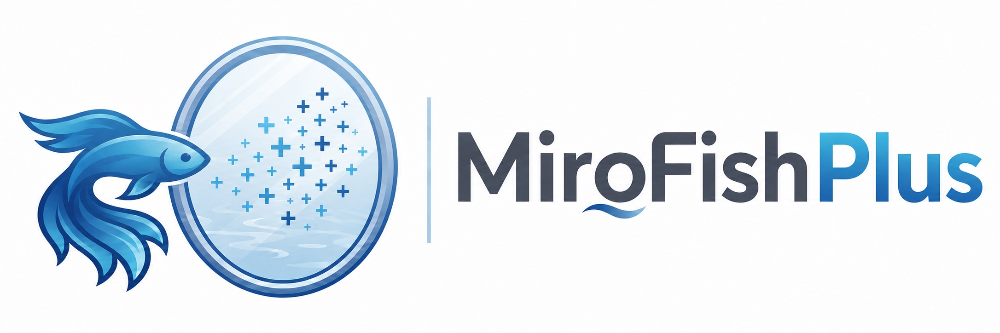
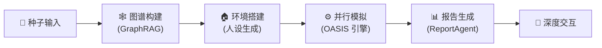

<div align="center">



# MiroFishPlus

**基于官方 [MiroFish](https://github.com/666ghj/MiroFish) 与社区项目 [MiroFish-local](https://github.com/tt-a1i/MiroFish-local) 持续演进的增强版。**

*多智能体群体智能仿真引擎，模拟舆情、市场情绪与社会动态；图谱、配置和任务数据可保留在本地。*

[](https://github.com/mustangcoder/MiroFish/stargazers)
[](https://github.com/mustangcoder/MiroFish/network)
[](https://github.com/mustangcoder/MiroFish/blob/main/LICENSE)
[](https://www.docker.com/)

[English](./README-EN.md) | [中文文档](./README.md)

</div>

## 🤔 这是什么？

[MiroFish](https://github.com/666ghj/MiroFish) 是一款基于多智能体技术的 AI 预测引擎，通过构建高保真平行数字世界进行群体智能仿真。但原版 MiroFish 的记忆与知识图谱完全依赖 **Zep Cloud** 云服务——数据经过云端，且无法在离线环境运行。

社区项目 [tt-a1i/MiroFish-local](https://github.com/tt-a1i/MiroFish-local) 在官方版本基础上实现了 **Graphiti + Neo4j 本地图谱模式**、`ZEP_BACKEND` 双模式切换和本地部署基础。本项目继承这部分工作，并继续扩展模型协议与配置中心、ChatGPT Subscription OAuth、SQLite 持久化恢复、Graphiti 本体类型、长任务可靠性和一键迁移部署等能力。

## 🔀 与官方项目的区别

本仓库同时基于 [666ghj/MiroFish](https://github.com/666ghj/MiroFish) 和 [tt-a1i/MiroFish-local](https://github.com/tt-a1i/MiroFish-local)，**不是上述任一项目的官方发行版，也不代表其维护团队**。下表以 **2026-09-02 官方 `main` 分支**为比较基准；上游持续演进后，部分差异可能缩小或消失。

| 继承层级 | 主要贡献 |
|----------|----------|
| 官方 MiroFish | 多智能体推演主流程、OASIS 双平台模拟、知识图谱与 ReportAgent 工作流 |
| MiroFish-local | Graphiti + Neo4j 本地图谱、Zep Cloud/Graphiti 双模式与本地化部署基础 |
| MiroFishPlus | 多协议模型配置、OAuth Gateway、统一 SQLite 与断点恢复、本体类型、图谱补偿、可靠性优化和完整一键迁移 |

| 维度 | 官方项目（比较基准） | 本项目 MiroFishPlus |
|------|----------------------|-----------------------|
| 核心定位 | 通用多智能体预测引擎，默认使用 Zep Cloud | 保留官方工作流，重点增强本地部署、模型接入和长任务可靠性 |
| 图谱服务 | Zep Cloud | 可在配置中心选择 Zep Cloud，或使用 **Graphiti + Neo4j 5.26** |
| 本地图谱类型 | 不适用 | 将项目本体传入 Graphiti，保留业务实体标签，并区分人物、机构、地区与事件 |
| 文本模型协议 | 通过 OpenAI SDK 兼容接口配置单一 LLM | 协议层支持 **OpenAI Responses、OpenAI Chat Completions、Anthropic Messages** |
| Embedding | 跟随官方环境变量配置 | 独立支持 OpenAI Embeddings 协议，可与文本模型选择不同 Provider 和模型 |
| 模型接入 | `.env` 中配置 API Key、Base URL 和模型名 | 配置中心分离 Provider、协议、认证和具体模型；支持 API Key、无需认证及 ChatGPT Subscription OAuth Gateway |
| 模型职责 | 主模型与可选加速模型 | 高能力、快速、Embedding 三个职责独立选择，并保存项目级配置快照 |
| 上下文管理 | 依赖模型/API 默认行为 | 可配置模型最大上下文，按窗口动态裁剪，保持工具调用与结果成对，并为标准 Responses 启用自动截断 |
| 配置持久化 | 主要依赖 `.env` | 模型、图谱后端、任务和准备检查点统一持久化到 `backend/uploads/mirofishplus.db` |
| 环境准备恢复 | 页面或服务中断后可能重新开始 | 每完成人设即写入 SQLite 检查点；刷新页面或服务重启后只生成缺失部分 |
| 模拟与图谱写入 | 双平台模拟并动态更新记忆 | 增加同轮次聚合、字符/Token 预算、限流退避、完成屏障和缺失 Episode 精确补写 |
| 历史流程恢复 | 官方基础流程 | 根据持久化状态返回最近节点，避免从历史记录进入后重复生成人设或重启模拟 |
| 报告与采访 | ReportAgent 调用模拟环境和图谱工具 | 检查真实 OASIS 进程；陈旧 `alive` 状态会修正为 `stale`，采访不可用时立即回退到图谱检索 |
| Docker 启动 | 复制 `.env` 后执行 `docker compose up -d`，默认拉取官方镜像 | `npm run docker:up` 构建最新本地代码，启动 Neo4j/Gateway，幂等初始化 SQLite 并等待健康检查 |
| Hugging Face 模型 | 按运行环境下载 | 持久化缓存、预下载并设置明确的下载超时 |

### 兼容性与维护边界

- **本地不等于完全离线。** Graphiti 和 Neo4j 可留在本机，但所选文本模型或 Embedding Provider 仍可能是远程 HTTP 服务；只有全部 Provider 都指向本地服务时，模型数据才不离开本机。
- **ChatGPT Subscription OAuth Gateway 不是 OpenAI 官方公开 API。** 它依赖 ChatGPT/Codex 内部接口，可能因上游协议、权限或限流策略变化而失效；生产环境优先使用稳定的官方 API Key 接入。
- **旧图谱不会自动重写类型。** 升级前已经构建、且只含 `Entity` / `GenericEntity` 的本地 Graphiti 图谱，需要强制重建后才能获得新的本体标签和更准确的人设分类。
- **Zep Cloud 与本地 Graphiti 不保证结果完全一致。** 两者在抽取、去重、搜索和时序关系处理上可能产生不同结果，切换后建议重新构建图谱并验收。
- 官方功能、问题与版本发布请以官方仓库为准；本项目新增功能和问题在本仓库独立维护。

## ⚡ 3 分钟体验

```bash
git clone https://github.com/mustangcoder/MiroFish.git
cd MiroFish
cp .env.example .env           # 编辑 .env 填入 LLM_API_KEY
npm run setup:all              # 安装依赖
npm run backend &              # 启动后端
python demo.py                 # 运行 Demo！
```

Demo 脚本会自动上传一条[示例新闻](./examples/seed_news.txt)，调用 LLM 提取实体关系并构建知识图谱，让你直观看到 MiroFish 的核心能力。

## 🏗️ 系统架构



| 模块 | 说明 |
|------|------|
| **种子输入** | 接收用户上传的种子材料（新闻、报告、小说等），解析预测需求 |
| **图谱构建** | 基于 GraphRAG 提取实体关系，注入个体与群体记忆，构建知识图谱。本地模式使用 Graphiti + Neo4j 替代 Zep Cloud |
| **环境搭建** | 自动生成智能体人设，由环境配置 Agent 注入仿真参数 |
| **并行模拟** | OASIS 引擎驱动大规模智能体并行交互，动态更新时序记忆 |
| **报告生成** | ReportAgent 使用丰富工具集与模拟后环境深度交互，生成预测报告 |
| **深度交互** | 用户可与模拟世界中的任意角色对话，或与 ReportAgent 进一步探讨 |

## 🔄 工作流程

1. **图谱构建** — 现实种子提取 & 个体与群体记忆注入 & GraphRAG 构建。系统从用户上传的种子材料中抽取关键实体与关系，构建结构化知识图谱，为仿真世界奠定信息基础。

2. **环境搭建** — 实体关系抽取 & 人设生成 & 环境配置 Agent 注入仿真参数。基于图谱自动生成具有独立人格和背景故事的智能体，配置社交网络拓扑与初始行为参数。

3. **开始模拟** — 双平台并行模拟 & 自动解析预测需求 & 动态更新时序记忆。OASIS 引擎驱动智能体在仿真环境中自由交互，实时记录行为轨迹与态度变化。

4. **报告生成** — ReportAgent 拥有丰富的工具集与模拟后环境进行深度交互。汇聚仿真数据，从多维度分析群体行为模式，输出结构化预测报告。

5. **深度互动** — 与模拟世界中的任意角色进行对话 & 与 ReportAgent 进行对话。用户可随时介入仿真世界，探索不同决策路径下的演化结果。

## 🎯 应用场景

| 场景 | 描述 |
|------|------|
| 🗞️ **舆情预测与危机公关预演** | 模拟突发事件在社交网络中的传播路径，预判舆论走向，提前制定应对方案 |
| 💹 **金融市场情绪推演** | 构建投资者群体行为模型，模拟市场对政策、事件的反应，辅助投资决策 |
| 🏛️ **政策影响评估** | 在虚拟社会中预演政策实施效果，观察不同群体的行为反馈与社会影响 |
| ✍️ **创意实验** | 小说结局推演、历史事件重演、脑洞验证——让想象力在数字世界中自由奔跑 |
| 🔬 **社会科学研究模拟** | 为社会学、传播学、行为经济学等学科提供大规模可控实验平台 |

## 🚀 快速开始

### 前置要求

> 注：MiroFish 在 Mac 环境下完成开发与测试，Windows 兼容性未知，测试中

| 工具 | 版本要求 | 说明 | 安装检查 |
|------|---------|------|---------|
| **Python** | 3.11+ | 后端运行环境 | `python --version` |
| **Node.js** | 18+ | 前端运行环境，包含 npm | `node -v` |
| **uv** | 最新版 | Python 包管理器 | `uv --version` |
| **Docker** *(可选)* | 最新版 | 本地模式启动 Neo4j 等依赖服务 | `docker --version` |

### 1. 配置环境变量

```bash
# 复制示例配置文件
cp .env.example .env

# 编辑 .env 文件，填入必要的 API 密钥
```

环境变量分为以下几组：

#### LLM API 配置（必需）

支持 OpenAI Responses、OpenAI Chat Completions 和 Anthropic Messages 三种文本协议。推荐使用阿里百炼平台 qwen-plus 模型时选择 `openai_chat_completions`。

> 注意：模拟消耗较大，建议先进行小于 40 轮的模拟尝试。

Docker 部署会将 Hugging Face 模型缓存持久化到 `huggingface_cache` 卷，并在独立的 `hf-prefetch` 服务中预下载 OASIS Twitter 推荐模型。推演启动前会再次检查缓存；下载超过 15 分钟会明确失败，而不会让任务无限停留在运行中。

MiroFishPlus 自有的模型配置、后台任务和环境准备检查点统一保存在 `backend/uploads/mirofishplus.db`。升级时会先无损复制旧 `mirofish.db`，再幂等导入旧的 `model-config/models.db` 与 `tasks/tasks.db`，并保留所有旧文件。OASIS 生成的 Twitter/Reddit 平台数据库仍按模拟单独保存。环境准备每完成一个人设都会提交检查点；服务异常重启后会复用原任务并从缺失的人设继续。

```env
LLM_API_KEY=your_api_key
LLM_BASE_URL=https://dashscope.aliyuncs.com/compatible-mode/v1
LLM_MODEL_NAME=qwen-plus
LLM_PROTOCOL=openai_chat_completions
```

配置中心会将模型厂商、接口协议和认证方式分别保存。一个 Provider 连接可以启用多个协议：系统会自动探测，用户也可以手动修正。三个模型职责分别选择 Provider、协议和具体模型，因此同一个 LM Studio 连接可以同时承担文本生成与 Embedding。可选协议值为 `openai_responses`、`openai_chat_completions`、`anthropic_messages` 和 `openai_embeddings`。Docker 连接宿主机模型服务时请使用 `http://host.docker.internal:<port>/v1`。

#### 知识图谱服务选择

通过 `ZEP_BACKEND` 切换知识图谱的存储与检索方式：

| 值 | 模式 | 说明 |
|---|------|------|
| `cloud` | Zep Cloud（默认） | 零配置，每月免费额度即可上手 |
| `graphiti` | 本地 Graphiti + Neo4j | 完全本地化，数据不出域 |

```env
ZEP_BACKEND=cloud
```

#### Zep Cloud 配置（`ZEP_BACKEND=cloud` 时必需）

免费注册：https://app.getzep.com/

```env
ZEP_API_KEY=your_zep_api_key
```

#### Graphiti / Neo4j 本地配置（`ZEP_BACKEND=graphiti` 时必需）

```env
NEO4J_URI=bolt://localhost:7687
NEO4J_USER=neo4j
NEO4J_PASSWORD=password

# Graphiti 使用的 LLM 模型（推荐显式配置）
GRAPHITI_LLM_MODEL=qwen3-max
GRAPHITI_LLM_PROTOCOL=openai_chat_completions
GRAPHITI_EMBEDDING_MODEL=text-embedding-v4
```

> `OPENAI_API_KEY` / `OPENAI_BASE_URL` 会自动从 `LLM_API_KEY` / `LLM_BASE_URL` 映射，无需重复配置。如需单独指定 Graphiti 使用的 LLM，可显式设置 `OPENAI_API_KEY` 和 `OPENAI_BASE_URL`。

> **本体类型迁移：** 新构建的本地图谱会把项目本体应用到 Graphiti 抽取，并在 Neo4j 节点上保留 `CompanyExecutive`、`ListedCompany` 等业务标签。升级前已构建且只有 `Entity` / `GenericEntity` 的图谱不会被自动改写；请在项目页面强制重建图谱，并重新准备推演环境以生成人设。Zep Cloud 的本体写入流程不变，但会共享相同的人物/机构/地区/事件分类逻辑。

> **模型上下文：** 配置中心的文本模型职责需要设置“最大上下文 Tokens”。已知 GPT-5.6 模型会自动填充 `1,050,000`，未知模型需要手工填写。模拟会按模型窗口动态预留 10%（最少 16K、最多 128K）用于输出和推理，超出输入预算时保留完整人设与系统提示，并从最旧的对话历史开始裁剪；工具调用和对应结果始终成对保留。标准 Responses Provider 还会使用 `truncation: auto` 作为保护；ChatGPT Subscription OAuth 依赖本地裁剪，因为其私有 Codex 接口不接受该字段。此设置与 Graphiti 的 9,500 字符 Episode 上限相互独立。

#### 加速 LLM 配置（可选）

可配置独立的加速 LLM 用于提升特定环节的处理速度：

```env
LLM_BOOST_API_KEY=your_boost_api_key
LLM_BOOST_BASE_URL=https://another-api-provider.com/v1
LLM_BOOST_MODEL_NAME=gpt-4o-mini
```

### 2. 一键 Docker 启动（推荐）

确保 Docker Desktop 已启动，然后在项目根目录执行：

```bash
npm run docker:up
```

该命令会自动创建缺失的 `.env`、迁移旧 Docker 卷、启动 Neo4j 5.26 与 Direct OAuth Gateway，初始化或迁移 `backend/uploads/mirofishplus.db`，最后启动 MiroFishPlus 并等待健康检查。重复执行不会重置模型配置、任务记录、环境准备检查点、上传文件或 Docker 卷。

从旧版 Docker 名称首次升级时，脚本会停止但保留旧容器，将 `mirofish_*` 命名卷只读复制到 `mirofishplus_*`，校验文件数和字节数后写入迁移标记。旧卷不会删除；首次迁移会额外占用约等于旧卷大小的磁盘空间。生产 Compose 的 `mirofishplus_uploads` 与 `mirofishplus_embedding_cache` 可使用 `scripts/migrate-docker-volume.sh OLD_VOLUME NEW_VOLUME` 按相同规则迁移。

启动完成后可访问：

- 前端：`http://localhost:3000`
- 后端健康检查：`http://localhost:5001/health`
- Neo4j Browser：`http://localhost:7474`

启动失败时脚本会保留现场并打印诊断命令。也可以手动查看日志：

```bash
docker compose -f docker-compose.yml -f docker-compose.local.yml logs --tail=200
```

### 3. 手动启动依赖服务（可选）

如果选择 `ZEP_BACKEND=graphiti`，需要先启动 Neo4j 数据库：

```bash
# 使用 Docker Compose 启动依赖服务（Neo4j 5.26 + APOC 插件）
docker-compose -f docker-compose.local.yml up -d

# 检查服务状态
docker-compose -f docker-compose.local.yml ps

# Neo4j Browser 可通过 http://localhost:7474 访问（用户名: neo4j, 密码: password）
```

### 4. 安装依赖

```bash
# 一键安装所有依赖（根目录 + 前端 + 后端）
npm run setup:all
```

或者分步安装：

```bash
# 安装 Node 依赖（根目录 + 前端）
npm run setup

# 安装 Python 依赖（自动创建虚拟环境）
npm run setup:backend
```

### 5. 启动非 Docker 开发服务

```bash
# 同时启动前后端（在项目根目录执行）
npm run dev
```

**服务地址：**
- 前端：`http://localhost:3000`
- 后端 API：`http://localhost:5001`

**单独启动：**

```bash
npm run backend   # 仅启动后端
npm run frontend  # 仅启动前端
```

## 💻 硬件需求

MiroFish 本身是 LLM 调用型应用，计算主要依赖远端 LLM API，本地资源需求较低。

| 配置 | CPU | 内存 | 磁盘 | GPU |
|------|-----|------|------|-----|
| **最低配置** | 4 核 | 8 GB | 10 GB | 不需要 |
| **推荐配置** | 8 核 | 16 GB | 20 GB | 不需要 |

> 说明：GPU 仅在本地部署 LLM（如使用 Ollama 等工具运行本地模型）时需要。使用云端 LLM API 无需 GPU。

## ❓ FAQ

<details>
<summary><b>Cloud 模式和本地模式有什么区别？</b></summary>

Cloud 模式使用 Zep Cloud 云服务存储记忆和知识图谱，配置简单但数据经过云端。本地模式使用 Graphiti + Neo4j，数据完全留在本地，适合对数据隐私有要求或无外网的环境。通过 `ZEP_BACKEND` 环境变量一键切换。
</details>

<details>
<summary><b>Neo4j 启动失败怎么办？</b></summary>

1. 确认 Docker 已安装并运行：`docker --version`
2. 检查端口 7474/7687 是否被占用：`lsof -i :7474`
3. 查看容器日志：`docker-compose -f docker-compose.local.yml logs neo4j`
4. 尝试清理重启：`docker-compose -f docker-compose.local.yml down -v && docker-compose -f docker-compose.local.yml up -d`
</details>

<details>
<summary><b>支持哪些 LLM？</b></summary>

支持任何兼容 OpenAI SDK 格式的 LLM API，包括：阿里百炼（qwen-plus/qwen-max）、OpenAI（GPT-4o）、DeepSeek、本地 Ollama 等。只需配置 `LLM_BASE_URL` 和 `LLM_API_KEY` 即可。
</details>

<details>
<summary><b>模拟一次大概消耗多少 Token？</b></summary>

取决于智能体数量和模拟轮次。建议首次体验使用少于 40 轮的模拟，消耗约 50-100 万 Token。
</details>

## 🤝 贡献指南

欢迎提交 Pull Request 和 Issue！详见 [CONTRIBUTING.md](./CONTRIBUTING.md)。

## 📄 致谢与归属

**本项目同时基于官方 [666ghj/MiroFish](https://github.com/666ghj/MiroFish) 与社区项目 [tt-a1i/MiroFish-local](https://github.com/tt-a1i/MiroFish-local)。**

感谢官方项目、盛大集团，以及 MiroFish-local 维护者对 Graphiti + Neo4j 本地化方案的开源贡献。MiroFish 的核心仿真引擎由 **[OASIS](https://github.com/camel-ai/oasis)** 驱动，OASIS 是由 [CAMEL-AI](https://github.com/camel-ai) 团队开发的高性能社交媒体模拟框架。

MiroFishPlus 在上述基础上继续增加配置中心、多模型协议、OAuth Gateway、统一 SQLite、准备进度恢复、Graphiti 类型与写入补偿、推演生命周期修复及一键品牌迁移。

## 📈 项目统计

<a href="https://www.star-history.com/#mustangcoder/MiroFish&type=date&legend=top-left">
 <picture>
   <source media="(prefers-color-scheme: dark)" srcset="https://api.star-history.com/svg?repos=mustangcoder/MiroFish&type=date&theme=dark&legend=top-left" />
   <source media="(prefers-color-scheme: light)" srcset="https://api.star-history.com/svg?repos=mustangcoder/MiroFish&type=date&legend=top-left" />
   
 </picture>
</a>
